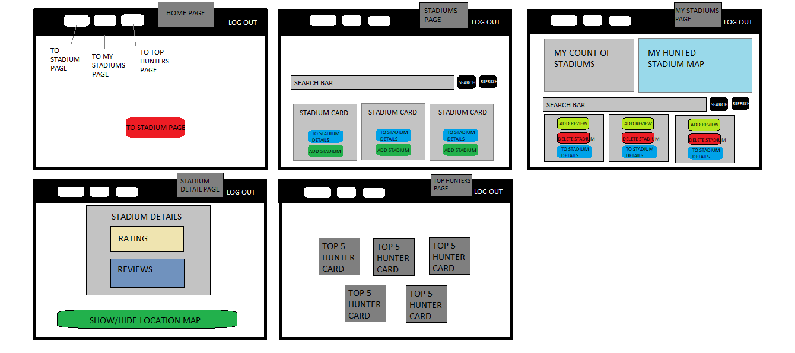
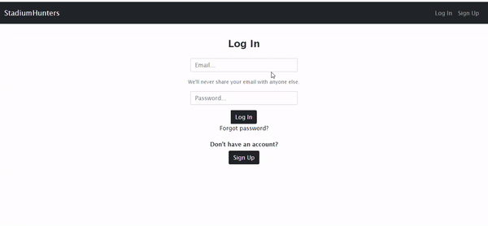
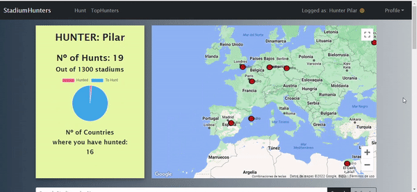
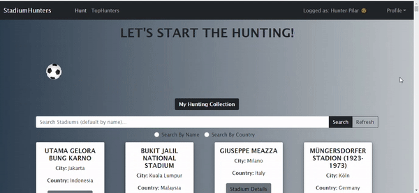
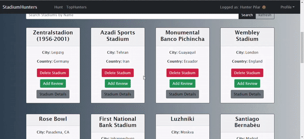
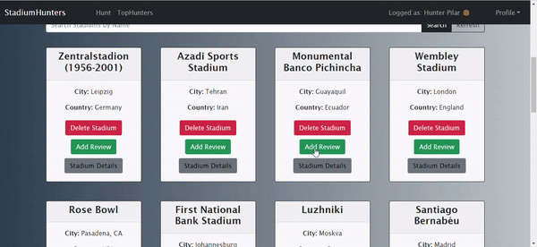
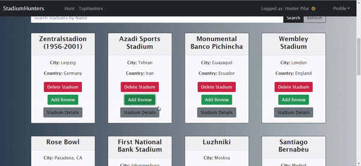
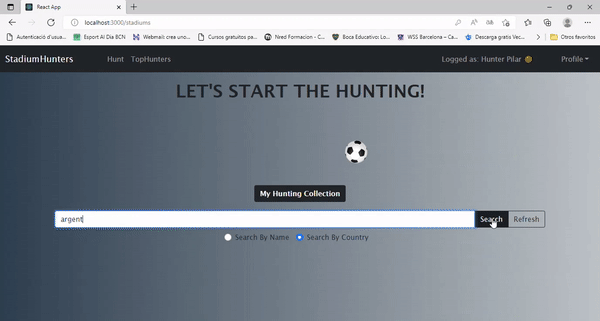

<!-- PROJECT LOGO -->
<br />
<div align="center">
  
 
 
</div>


## Table of Contents
* [General Info](#general-information)
* [Setup](#setup)
* [Technologies Used](#technologies-used)
* [Components and Pages Structure](#components-and-pages-structure)
* [Demo](#demo)
* [Project Status](#project-status)
* [Room for Improvement](#room-for-improvement)
* [Resources](#resources)


## :grey_exclamation: General Information
This project is the frontend or client side of the Stadium Hunter Web application and it was made as the final project of a full stack development bootcamp.
Stadium Hunter is an app that allows users to keep track of all the football stadiums they have visited and leave reviews on them.


## :gear: Setup

For development, you will only need Node.js installed on your environement. 

[Node](http://nodejs.org/) is really easy to install & now include [NPM](https://npmjs.org/).
You should be able to run the following command after the installation procedure
below.

    $ node --version
    

    $ npm --version
   


#### Node installation on Windows

Just go on [official Node.js website](http://nodejs.org/) & grab the installer.
Also, be sure to have `git` available in your PATH, `npm` might need it.


Clone the repo
   ```sh
   git clone https://github.com/Openbank-Java-Bootcamp/Pilar-Alvarez-Stadium-Hunter-Client
   ```
Install NPM packages
   ```sh
   npm install
   ```
Start
   ```sh
   $ npm start
   ```


## :hammer_and_wrench: Technologies used


* [React.js](https://reactjs.org/)
* [Bootstrap](https://getbootstrap.com)
* [JavaScript](https://www.javascript.com/)


## :computer: Components and Pages Structure

### Pages
* SignUp Page
* Login Page
* Home Page
* Stadiums Page
* User Profile Page
* Stadium Details Page
* Top Users Page


### Components
* Hunt Stadium Button
* Delete Stadium Button
* Add Review Button
* Search Input Form




## :movie_camera: Demo

Login Page 



User Profile Page



"Hunt" a Stadium (Add it to your profile)



Add a Review to a Stadium



Delete a Stadium from your profile



See stadium details and reviews



Search a Stadium by Name or by Country




## :hourglass: Project Status
Project is: _no longer being worked on_.
This is a final project to a Full Stack Developer Bootcamp, although the idea of ​​the app motivates me, I consider the work finished with the purposes it was supposed to.


## :rocket: Room for Improvement

- Let users add images to the review.
- Improve the styling.
- Integrate a chat so users can chat with other users.
- Add functionality to the map, in order to display the stadium info o filtrate stadiums in the list.


## :books: Resources

Instructors of Ironhack: Raymond & Shaun.

https://react-bootstrap.github.io/

https://stackoverflow.com/

https://www.youtube.com/
